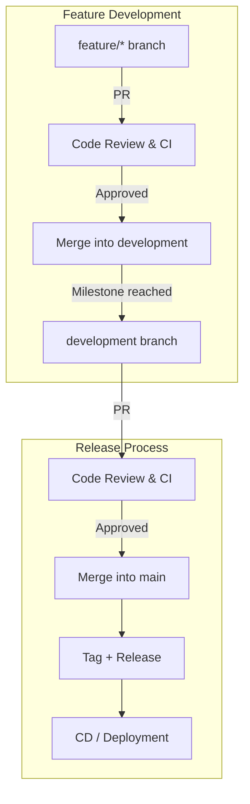

# Releases & Versioning Guide

This document explains how we will handle **versioning, releases, and CI/CD** for the Classtro project.

---

## 🔹 Versioning Standard

We follow **Semantic Versioning (SemVer)**:

```
MAJOR.MINOR.PATCH
```

- **MAJOR** → breaking changes (e.g., change architecture)
- **MINOR** → new features (e.g., add analytics dashboard)
- **PATCH** → bug fixes or small improvements (e.g., fix socket reconnect)

👉 Example:

- `v0.4.0` → Polls + Q&A module
- `v0.4.1` → Bugfix in Q&A
- `v0.5.0` → Quizzes added
- `v1.0.0` → Full demo-ready release

---

## 🔹 When to Release

- Merge **features** into `development` only.
- After **2–3 stable features**, open a PR from `development` → `main`.
- Once merged, tag that commit as a release version.

👉 Don’t tag every small feature. Use tags for milestones.

---

## 🔹 How to Create a Tag & Release

1. Checkout `main` and pull latest:
   ```bash
   git checkout main
   git pull origin main
   ```
2. Create a tag:
   ```bash
   git tag v0.4.0
   git push origin v0.4.0
   ```
3. On GitHub → **Releases** → Draft a new release:
   - Select tag: `v0.4.0`
   - Add title + notes (features, fixes)
   - Publish ✅

---

## 🔹 CI/CD Workflow

- **CI (Continuous Integration):**
  - Runs on all PRs to `development`.
  - Checks lint + tests to ensure code works before merging.

- **CD (Continuous Deployment):**
  - Runs only on merges into `main`.
  - Automatically deploys stable version (frontend to Netlify/Vercel, backend to Render/AWS).

👉 Flow:

```
feature/* → PR → CI + Code Review → merge → development

[Milestone reached]

development → PR → CI + Code Review → merge → main → Tag + Release → CD (deploy

```



### Description

1. **Feature Branch (`feature/*`)**: Developers create feature branches for new functionality.
2. **Pull Request (PR) to Development**: Features are merged into `development` after CI checks and code review.
3. **Development Milestone**: Once features accumulate or a milestone is reached, `development` is prepared for main release.
4. **Pull Request (PR) to Main**: The development branch is reviewed, CI runs again, and then merged into `main`.
5. **Tag & Release**: A new release tag is created in `main`.
6. **Continuous Deployment (CD)**: Code from `main` is deployed to production automatically.

This workflow ensures structured development, review, testing, and deployment.
)
